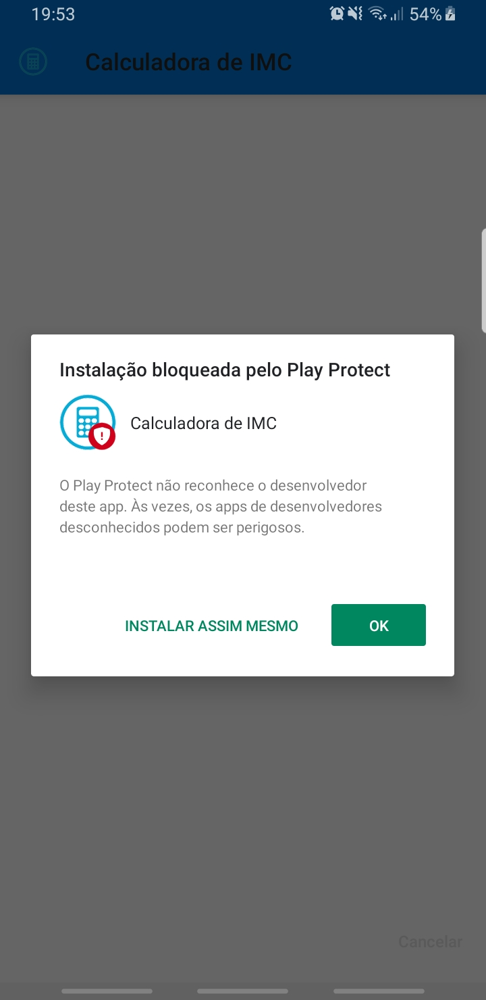
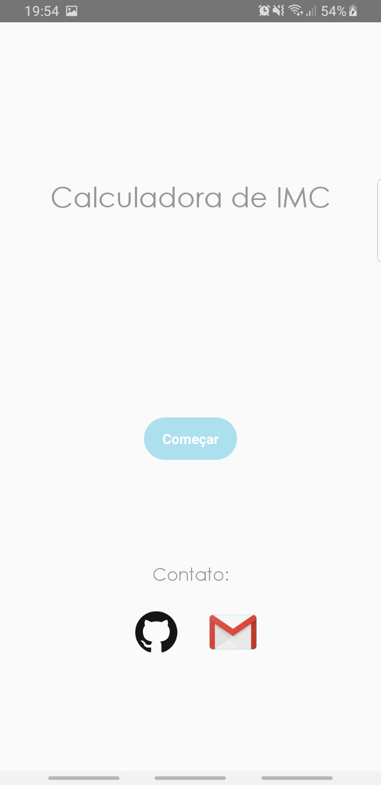
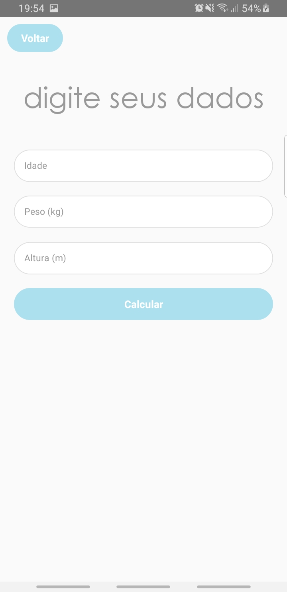
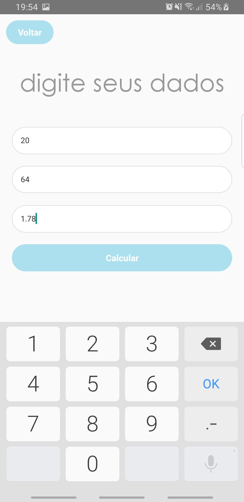
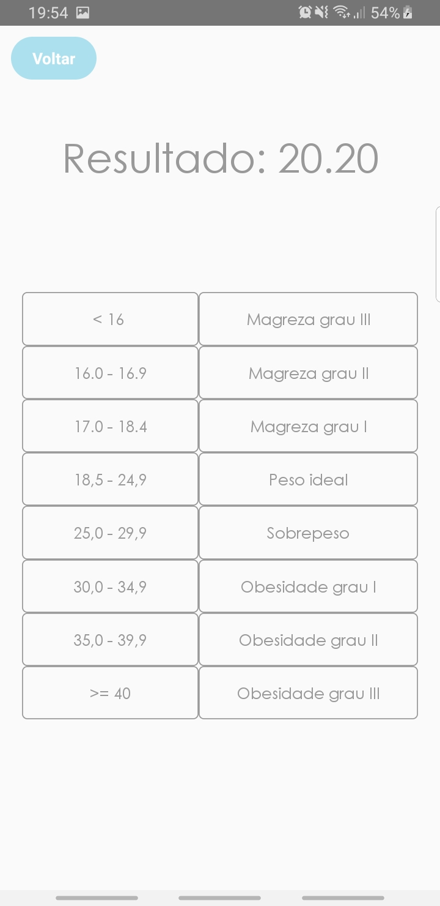

# CalculadoraIMC

        

# Sobre o projeto

 - Projeto criado para praticar meu aprendizado em React Native.

# Link do app

  - Android: [Calculadora de IMC](https://drive.google.com/open?id=1XfY17qKEqGMthunQa01_Op86wOZa6kVR)
  
  - IOS: Em breve
  
  
# Para rodar em modo desenvolvedor

### Caso esteja usando um emulador

##### Configurando o ambiente

  - Você precisará configurar um ambiente básico para rodar um app feito com React Native. Siga o passo a passo da [RocketSeat](https://docs.rocketseat.dev/ambiente-react-native/introducao);

  - Clone o repositório ou faça download em uma pasta, depois, entre na pasta CalculadoraIMC onde está todo o projeto;

##### Instalando as dependências

  - No terminal (onde está todo o projeto):

    `$ yarn`

     ou

    `$ npm install`
   
    
##### Rodando

  - Abra o emulador e insara no terminal:
        
    `$ react-native run-android` 

    `$ react-native start`

### Caso esteja usando o próprio celular:
  
  - Ative o modo desenvolvedor seguindo os passos abaixo:

    - Configurações > Sobre o telefone > Informações de software > 'clique 5 vezes em `Número de compilação`'

  - Volte na página inicial das configurações e vá em:

    - Opções de desenvolvedor > Depuração > 'ative `Depuração USB`'
  
  - Agora, conecte o aparelho no computador e execute no terminal:
    
    `$ react-native run-android` 

    `$ react-native start`
  
